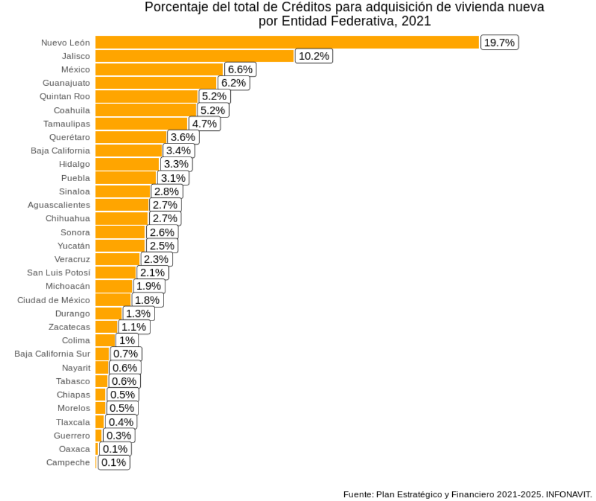

<style>

  p.footnote{
  color:#5e5e5e;
  font-size:90%;
  text-align:center;
  }
  
  img {
    width: 40%;
    height: auto;
}
    
</style>

A inicios de año generé un pequeño hilo de Twitter sobre como aprovechar tablas provenientes de un `*.pdf` en nuestros análisis de `#rstats`. 

<blockquote class="twitter-tweet"><p lang="es" dir="ltr">Pues bueno, igualmente para mi primer hilo del año voy a re-crear este hilo de <a href="https://twitter.com/claudiodanielpc?ref_src=twsrc%5Etfw">@claudiodanielpc</a> pero usando <a href="https://twitter.com/hashtag/RStats?src=hash&amp;ref_src=twsrc%5Etfw">#RStats</a> <a href="https://t.co/gifEKbJ9v3">https://t.co/gifEKbJ9v3</a></p>&mdash; Juvenal (@JuvenalCamposF) <a href="https://twitter.com/JuvenalCamposF/status/1347367599508647939?ref_src=twsrc%5Etfw">January 8, 2021</a></blockquote> <script async src="https://platform.twitter.com/widgets.js" charset="utf-8"></script>

Sin embargo, como generalmente los hilos de Twitter son vanos y se olvidan con el tiempo, he decidido generar una entrada de blog para tener el código a la mano para futuros trabajos y, de esta manera, no estar googleando mis hilos cada vez que necesite sacar información de tablas en `*.pdf`. Igualmente, tener la entrada de blog permite que otros usuarios puedan también acceder a este contenido de manera más fácil.

# Sobre mi hilo en Twitter: 

En mi hilo quise puntualizar algunos aspectos de la extracción de tablas a través de códigos en #rstats: 

> 1. Primero, la librería `tabula`, o `tabula-py` es una librería de Python que es un **wrapper** de una librería de Java que también se llama tabula.
En R **también existen estas librerías wrapper**, y, en este caso, la librería se llama `[tabulizer](https://cran.r-project.org/web/packages/tabulizer/vignettes/tabulizer.html)`.

<p style = 'text-align:center;'>

</p>

> 2. Para poder utilizar estas librerías basadas en Java se requiere bajar a nuestra sesión de **R** la librería `rJava` y, obvio, tener una distribución de `Java` instalada en tu computadora...
...O [en su defecto] usar `RStudio Cloud`, que es como `RStudio`, pero en la nube y sin problemas de librerías.

<p style = 'text-align:center;'>

</p>

> Otras librerías que igualmente usan Java son `mailR` (la que utilizo para mandar correos automatizados) o `RSelenium` (para hacer tests de p{aginas web o web scraping con usuarios automatizados).

Una de las cosas que descubrí re-haciendo el proceso de extracción de datos es que es **muy complicado instalar librerías que dependen de Java en computadoras Mac con procesador M1**. Por lo mismo, si planeas utilizar una de estas librerías (o si decides seguir este mini-tutorial) te recomiendo que no lo intentes desde una de estas nuevas Mac, ya que no vas a poder T__T. (O, si puedes, pásame el secreto). 

## Tablas en *.pdf

Muchas veces nos vamos a ver en la necesidad de extraer datos en `*.pdf`; ya sea porque es la única manera en que podemos encontrar la información, porque las personas que se encargan de proporcionarnos los datos de interés no conocen la conveniencia de presentar sus datos en formatos abiertos o quizá por el simple hecho de que quieren ser malos con nosotros y ponernos dificultades para realizar análisis a partir de sus datos.

En esta entrada de blog vamos a ocuparnos del _caso menos malo posible_: el caso en el que alguién pasó un archivo de Word a PDF con tablas en el. Estos archivos tienen la ventaja de que respetan cierta estructura y esto permite que la extracción de información sea más sencilla. 

Para esta labor, vamos a extraer datos del **Plan estratégico y financiero 2021-2025 de Infonavit**, el cual es un documento que trabajó el buen <a href = 'https://twitter.com/claudiodanielpc'>@claudiodanielpc</a> en un hilo parecido al mío, desde el cual extrajo los mismos datos, pero haciendo el proceso en Python. 

## Proceso: 

**Primero**, instalamos la librería `tabulizer`: 

```{r, eval = FALSE}
# Instalamos tabulizer 
install.packages("tabulizer") # Para instalar tabulizer en mi compu
```

**Segundo: ** Llamamos a las librerías y guardamos la ubicación del archivo del **Plan estratégico y financiero 2021-2025 de Infonavit**: 

```{r cache=FALSE, warning=FALSE, message=FALSE}
# Librerias ---- 
library(tabulizer) # Para leer tablas en pdf
library(tidyverse) # Para manipular datos
# # Obtenemos la url del Plan del INFONAVIT
# url <- "/home/juvenal/Descargas/Plan_Estrategico_y_Financiero_2020-2024.pdf"
url <- "https://portalmx.infonavit.org.mx/wps/wcm/connect/67e528e7-f13d-4dbf-a668-b29a594351c3/Plan_Estrategico_y_Financiero_2020-2024.pdf?MOD=AJPERES&CVID=mYkHiU3"
```

**Tercero: ** Ya que tenemos la dirección de nuestro archivo, ahora extraemos los datos que nos interesan. En este caso, queremos los datos de la Tabla 29: _Programa operativo Anual 2021 por estado,_ que se encuentra en la página 113.

<p style = 'text-align:center;'>

</p>
<!--  -->
<p class = 'footnote'>Fig. 1: La tabla de interés en la página 113. </p>

```{r}
# Extraemos la tabla de la página 113
tab <- extract_tables(url, 
                      pages = 113, 
                      method = "stream")
```

Del chunk de código de arriba podemos ver que la función para extraer tablas es la función `extract_tables()`, la cual recibe como primer argumento la ubicación del archivo, la página que contiene la tabla y el método de extracción de los datos. 

La función provee de dos métodos distintos para realizar la extracción de la información: el método `stream`, el algoritmo de extracción básico de `tabula`, el método `lattice`, el algoritmo de extracción de hojas de cálculo de `tabula`, y el método `decide`, que escoge, por página, el método más apropiado de los dos anteriores. _Todos los argumentos de la función se pueden consultar en la documentación de dicha función._ Otro argumento interesante es el argumento `area`, el cual permite al usuario seleccionar las coordenadas del documento en las cuales quiere que se enfoque el algoritmo para la extracción de información. 

En este caso, el algoritmo `lattice` extraía solamente los datos de los renglones que no tenían el fondo blanco, por lo que nos proporcionaba solamente la mitad de la información; por eso, tras prueba y error se decidió que el método ideal era el método que usaba el algoritmo `stream`.

**Cuarto: ** Ya con los datos extraídos dentro del objeto `tab`, aprovechamos los patrones de su estructura para poder darles una forma de tabla estructurada. 

En el último paso, vamos a romper la columna 6 para dividirla en 4 columnas adicionales a partir de los espacios guardados en cada celda. Para esto utilizamos la función `tidyr::separate()`.

```{r warning=FALSE}
# Generamos la tabla: 
matriz <- tab[[1]] %>% # Nos quedamos con la tabla
  as.tibble() %>% # Convertimos a tibble
  filter(V1 != "") %>% # Filtramos los renglones en blanco
  slice(-1) %>% # quitamos el primer renglón
  separate(V6, 
           into = c("V6", "V7", "V8", "V9"), 
           sep = "\\s") # Separamos la columna 6 en 4 columnas mas
# Utilizando el espacio. 
```

Ahora, vamos a renombrar las columnas a los nombres que vienen en el documento original. 

```{r}
# Le metemos los nombres personalizados (que signifiquen algo para nosotros)
names(matriz) <- c("Entidad", 
                   "Nueva", 
                   "Existente", 
                   "No Hipotecarios", 
                   "Total", 
                   "Infonavit", 
                   "Entidades Financieras", 
                   "No-hipotecarias", 
                   "Total (Derrama de Crédito)")

# Convertimos las columnas a numero
matriz[,2:9] <- lapply(matriz[,2:9], function(x){
  x %>% 
    str_remove_all(pattern = ",") %>% # Le quitamos las comas
    as.numeric() # Lo convertimos a numero
})
```

Y ya, finalmente armamos la gráfica utilizando código de `ggplot()`.

```{r, fig.height=10, eval = FALSE}
# Armamos las grafica de porcentaje de créditos por entidad:
# Generamos la base de datos a graficar
bd_plot <- matriz %>% 
  select(Entidad,Nueva) %>% 
  filter(Entidad != "Nacional") %>% 
  mutate(Pctje = 100*Nueva/sum(Nueva)) %>% 
  arrange(-Pctje) 
# Hacemos la gráfica
bd_plot %>% 
  ggplot(aes(x = reorder(Entidad, Pctje), y = Pctje)) + 
  geom_col(fill = "orange") + 
  coord_flip() + 
  geom_label(aes(label = paste0(round(Pctje,1), "%")), 
             hjust = -0.05) + 
  scale_y_continuous(expand = expansion(c(0,0.3), 0)) + 
  labs(y = "", x = "", 
       title = "Porcentaje del total de Créditos para adquisición de vivienda nueva\npor Entidad Federativa, 2021", 
       caption = "Fuente: Plan Estratégico y Financiero 2021-2025. INFONAVIT. ") +
  theme_minimal() + 
  theme(plot.title = element_text(hjust = 0.5), 
        panel.background = element_blank(), 
        panel.grid = element_blank(),
        axis.text.x = element_blank())
```



Finalmente, concluí el hilo con el siguiente mensaje: 

> Y listo. Con este hilo, quiero mostrar que muchas de las tareas sencillas de esto del manejo de los datos se pueden hacer de manera sencilla tanto en #Rstats como en #Python, y que los pasos son prácticamente los mismos, solo cambia la sintaxis. :P
_Ese es todo el hilo. Si andan sin quehacer y quieren repasar sus conocimientos de importar tablas de `pdf`, de `dplyr` o de hacer gráficas de barras en R, en este enlace esta el código completo:_ 

https://github.com/JuveCampos/juveBlog/blob/master/tabula/recreandoTablaDanielPC.R


### Otras librerías para tratar con datos en pdf. 

El ejemplo de esta entrada de blog es algo muy sencillo; cada pdf es es distinto y dependiendo de su calidad, de su estructura y de la complejidad de su estructura va a ser la dificultad a la que nos vamos a enfrentar tratando de extraerle información. 

Otras librerías/paquetes de R muy útiles para lidiar con la extracción de datos provenientes de `pdfs` son la librería `pdftools` y la librería `tesseract` (o al menos son las que yo conozco). La primera es buena cuando la información que queremos extraer es información de texto, mientras que la segunda cuenta con un algoritmo de _reconocimiento óptico de caracteres_ para leer texto de pdfs escaneados (muy utilizados por parte de oficinas de gobierno, especialmente cuando responden solicitudes de información) o texto proveniente de imagenes. 

### En conclusión

Mas que una guía para extraer datos de `pdfs`, esta entrada tuvo el propósito de guardar, para futuras referencias, el proceso que llevé a cabo a principios de año con el documento de infonavit; de todos modos, espero que sirva como punto de partida para aquellas personas que estan empezando a usar R y de repente se topan con datos en estos formatos, para personas que quieran implementar procesos de extracción de datos con métodos replicables y para personas que quieran experimentar con alternativas a los programas comerciales para lidiar con pdfs (como `iLovePDF` o `textSniper`). 

Quedo al pendiente sobre dudas y observaciones al presente contenido; igualmente, si conocen alguna librería adicional, no duden en compartirla conmigo en mis redes :9

¡Saludos!


**--Juvenal**
