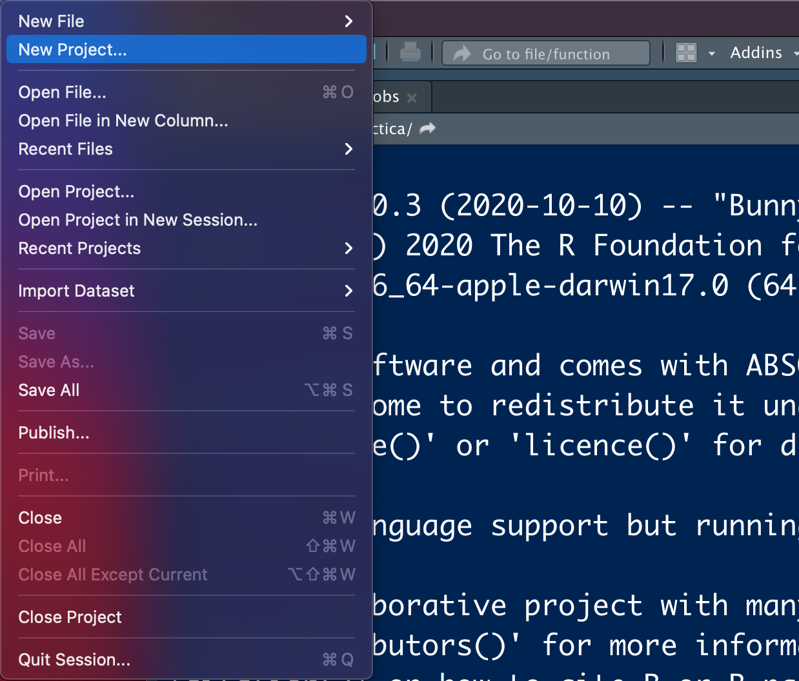
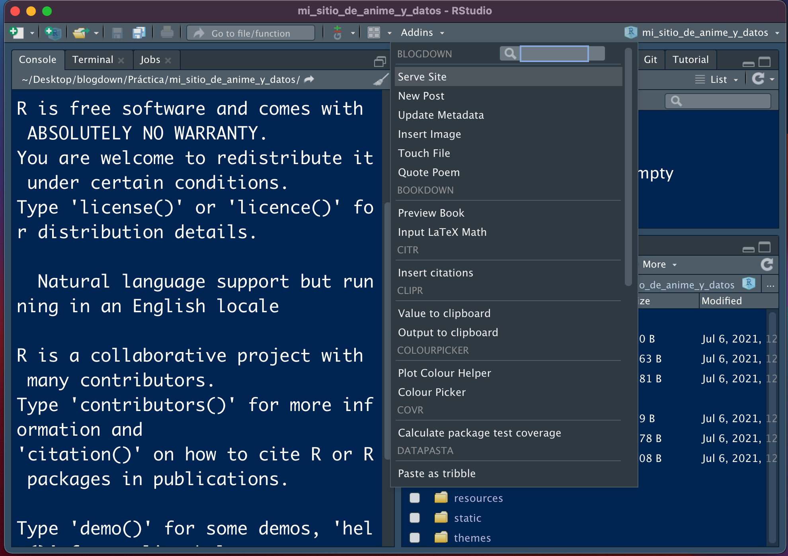

<style>

  p.footnote{
  color:#5e5e5e;
  font-size:90%;
  text-align:center;
  }
  
  img {
    width: 40%;
    height: auto;
}
    
</style>

```{r setup, include=FALSE}
knitr::opts_chunk$set(echo = TRUE)
```

<p style = 'color: gray;'>Contenido de la presentación brindada en el LNPP-Tech 2020.</p> 

## Importancia de tener un sitio personal

Es importante tener un sitio personal para: 

* Presentarnos efectivamente: nuestros intereses, nuestros proyectos, nuestras ideas y nuestra historia.

* Incrementar nuestra visibilidad en línea.

* Presentar los servicios y productos que ofrecemos. 

* Practicar nuestras habilidades de comunicación. 

* Es el CV moderno. Nos permite destacar y diferenciarnos de la competencia (que no tiene su propia página). 


## ¿Qué es RMarkdown? 

RMarkdown es la combinación del lenguaje de marcado `Markdown` combinado con las capacidades del lenguaje de programación `R` para analizar y visualizar datos. 

<!-- meter enlaces de los archivos -->
Al combinar ambos lenguajes tenemos la capacidad de crear una gran cantidad de documentos, que van desde una página web básica en HTML hasta documentos `*.pdf`, documentos de Word, presentaciones de diapositivas, libros electrónicos y, por supuesto, blogs personales.

## Blogdown

El paquete Blogdown es el paquete de R creado para generar sitios web estáticos personalizables en Markdown. Entre las ventajas que ofrece estan las siguientes: 

1) Podemos incluir y ejecutar código de R (o de cualquier otro lenguaje de programación soportado por el paquete `knit`).

2) Automáticamente nos genera (renderiza) resultados como gráficas, tablas, resultados de análisis estadísticos y widgets de HTML. 

3) Nos permite incluir citaciones, pies de página y ecuaciones `LATEX`.

Este paquete se encuentra disponible en el CRAN. Se puede instalar con el siguiente código: 

```{r eval=FALSE}
install.packages("blogdown")
```


## ¿Por qué usar `blogdown`? 

Las ventajas de `blogdown` con respecto a otros servicios (como `wordpress` o publicar en `medium`) consisten prácticamente en dos cosas: 

1) **Facilita la inclusión de código de R.** 

2) **Es gratuito**

3) **Te permite empezar a trabajar desde ya en tu sitio web**

## Framework Hugo

Por default, el paquete `blogdown` usa `Hugo`, un generador de sitios estáticos `open-source`, el cual provee una manera rápida y flexible de generar el contenido de tu sitio y de compartirlo en línea. 

Según su repositorio en línea, `Hugo` está optimizado para ser rápido, fácil de usar y ser altamente configurable. `Hugo` toma un directorio con contenido compatible y lo convierte en código HTML listo para ser publicado en la web. 

Cuando se utiliza en `blogdown`, instalamos `Hugo` desde RStudio (por lo que no debemos preocuparnos tanto por entenderlo en un principio).

Para revisar los temas disponibles para generar nuestros blogs, podemos consultar el enlace de temas disponibles para `Hugo`: https://themes.gohugo.io y ver cual nos agrada más. 

El código fuente de `Hugo` se puede consultar en este repositorio: https://github.com/gohugoio/hugo 

## Proceso de trabajo 

### Para crear el blog por primera vez: 

1. Nos vamos a `File > New Project > ` en la barra de herramientas de RStudio. 



2. Seleccionamos `New Directory >` para crear una carpeta con todos los archivos que se van a requerir. Una vez aquí seleccionamos la opción de `Website using blogdown` para generar un directorio adaptado a este fin. 


3. Una vez que vamos a crear el nuevo directorio, le damos un nombre y seleccionamos la opción de descargar `Hugo`, el tema que se va a ocupar (ver temas en https://themes.gohugo.io) y demás opciones por default. 

Terminamos por presionar `Create Project`.


4. Una vez que configuramos el proyecto y el paquete `blogdown` ya creo los archivos base, la sesión se tiene que ver como en la siguiente imagen: 


5. Para correr el sitio, nos vamos a la sección de `Addins`, le damos en `Serve Site` y en la ventana del visualizador se debería ver la página generada. 
 



6. La página generada se puede ver como en la imagen a continuación. Se utiliza el tema seleccionado y se ponen, por default, tres _posts_ que podemos eliminar en la carpeta de contenido. 


La página se puede modificar, modificando los archivos de la carpeta de `layouts` dentro de los archivos que ya nos instaló el paquete `blogdown`. Esto para darle una identidad propia, si se requiere. 


### Para publicar una nueva entrada: 

Para publicar una entrada, seguimos el siguiente procedimiento: 

1. Nos vamos a la sección de `Addins` y seleccionamos `New Post`. Una vez que lo hacemos, nos sale la siguiente ventana: 


2. Ya en esta ventana, rellenamos cada campo de metadatos con los datos que consideremos pertinentes. 


Y, a partir de acá, prosigue escribir el artículo con nuestros conocimientos de R y RMarkdown.

## ¿Donde Publicar mi blog? 

Los dos servicios más comunes para publicar páginas web de manera gratuita son `Github Pages` y `Netlify`. Podemos usar una de las dos, o ambas. 

En ambos casos, podemos almacenar el código y los archivos en un `repositorio de Github` para que el servicio genere la página (y para ahorrarnos también el costo de un servidor). Esto aplica solo para el caso de páginas web estáticas. 

`Github Pages` es un servicio de `Github` que permite construir una página web a partir de un repositorio de código. Para esto, tenemos que generar un repositorio y después cargar, en dicho repositorio, todo el código necesario para generar la página y configurar el repositorio para que muestre este contenido. 

Por su parte, `Netlify` es una compañía que ofrece servicios de computación en la nube para el almacenamiento de aplicaciones web y sitios estáticos (como un blog). Uno de sus servicios consiste en proveer almacenamiento (host) a páginas web almacenadas a través de un control de versiones `Git`, por lo que, al igual que el servicio anterior, nos permite almacenar páginas donde el código está almacenado en repositorios de `Github.` 

La ventaja de `Netlify` sobre `Github Pages` radica en que `Netlify` corre `Hugo` desde sus servidores, por lo que la carga de la página se hace de manera más rápida. Otra ventaja es que `Netlify` nos puede ayudar a gestionar la compra de dominios (direcciones web), por lo que si queremos que nuestra página tenga su dominio personalizado, lo podemos obtener/comprar de forma sencilla desde este servicio. 

## Algunos ejemplos: 

Algunos ejemplos:

* [Yihui Xie](https://yihui.org)

* [RStudio blog](https://blog.rstudio.com)

* [RViews blog](https://rviews.rstudio.com)

* [simplystatistics.](https://simplystatistics.org)

* [Rob Hyndman.](https://robjhyndman.com)

* [Karl Broman.](http://kbroman.org/)

* [Juvenal Campos](https://juvenalcampos.com)

## Referencias: 

* Librería de Github: https://github.com/rstudio/blogdown 

* Temas de Hugo: https://themes.gohugo.io 

* Libro de blogdown: https://bookdown.org/yihui/blogdown/ 

* Preguntas en stackoverflow: https://stackoverflow.com/questions/tagged/blogdown 

* Artículo en español: https://rubenfcasal.github.io/post/creación-de-sitios-web-con-blogdown/ 

* Blogdown en 2021: https://alison.rbind.io/blog/2020-12-new-year-new-blogdown/ 

* Página personal: https://pamepairo.netlify.app/post/7-12-2020-motivos-pagina-web/ 

* Webs con Rmarkdown: https://paocorrales.github.io/post/webs-con-rmarkdown/ 

* Wikipedia de Netlify: https://es.wikipedia.org/wiki/Hugo_(software)

* Curso `The personal website playbook` de Tom Hirst. Clase 01. https://www.tomhirst.com/products/personal-website-playbook/ 


