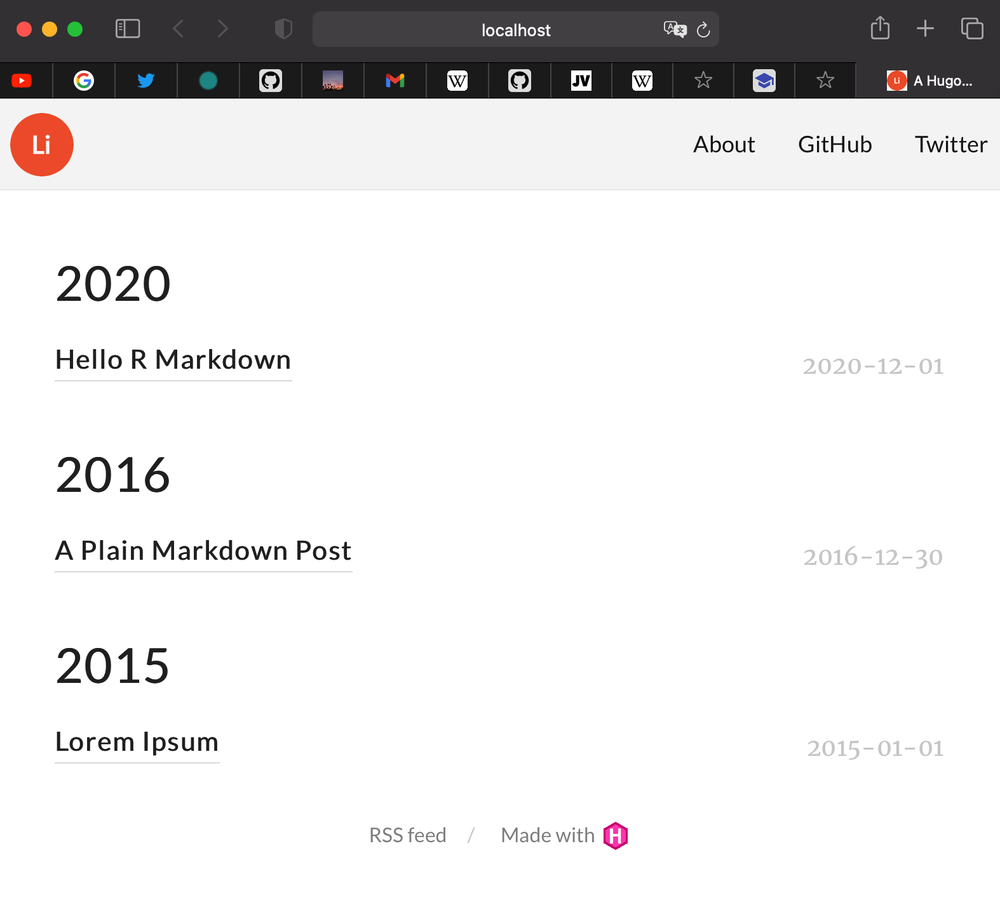
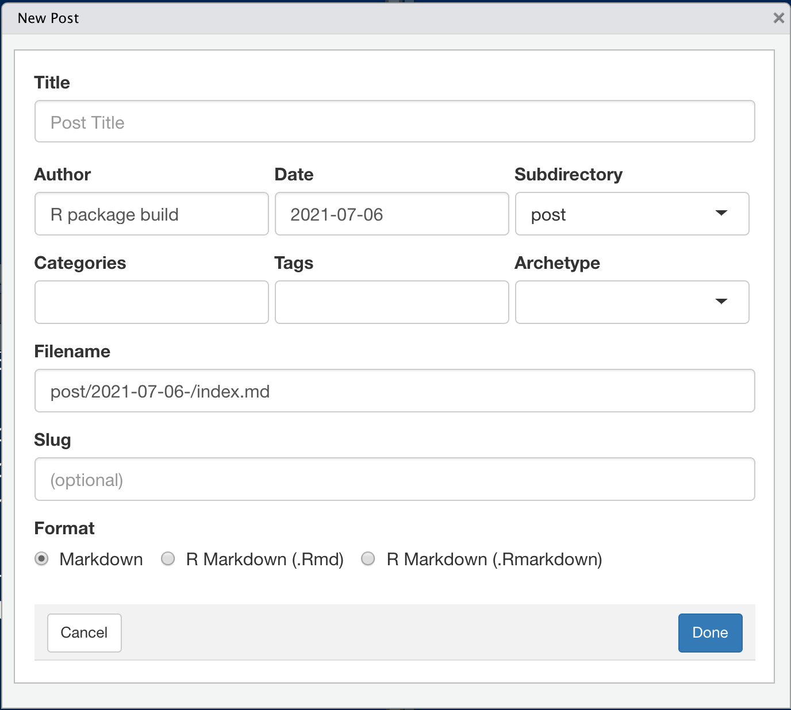

<style>

  p.centrado {
    text-align: center;
  }

  p.footnote{
  color:#5e5e5e;
  font-size:90%;
  text-align:center;
  }
  
  img {
    width: 40%;
    height: auto;
    text-align:center; 
}
    
</style>

```{r setup, include=FALSE}
knitr::opts_chunk$set(echo = TRUE)
```

<p style = 'color: gray;'>Contenido de una presentación brindada en el LNPP-Tech del 12 de marzo del 2020.</p> 


<p class = "centrado">
 15.30.54.png)
</p>

<p class = "footnote">Fig. 1. Este soy yo sin saber que pronto ibamos a dejar de trabajar de manera presencial</p>

## TL; DR

> Esta entrada de blog trata de explicar algunas generalidades sobre la creación y publicación de páginas web estilo _blog_ a traves del uso de la librería `blogdown` de R. 

## Motivación

Uno de los temas más comunes entre aquellas personas que escriben blogs de R es, precisamente, **como crear blogs en R**. Además, he visto tantos ultimamente, que decidí igualmente que ahora escribiría mi propio post sobre `blogdown`, mi experiencia utilizando la librería para generar blogs temáticos sobre R, como construí el mio y algunos tips y consejos después de un año creando y gestionando mi página con esta librería.

## Importancia de tener un sitio personal

Un **sitio personal** es una página web en la cual subimos contenido acerca de nosotros, de nuestro trabajo y de las cosas que nos gustan. 

En su curso, `The personal website playbook`, [Tom Hirst](https://www.tomhirst.com/products/personal-website-playbook/) nos da algunas de las ventajas de porque es conveniente contar con un sitio personal:  

* **Presentarnos efectivamente: nuestros intereses, nuestros proyectos, nuestras ideas y nuestra historia.** Una página web consiste de un gran espacio para expresarnos y comunicarnos. 

* **Incrementar nuestra visibilidad en línea.** Un sitio web bien diseñado puede ser una parte integral de nuestra estrategia comercial (si tenemos alguna).

* **Presentar los servicios y productos que ofrecemos: ** en caso de que los tengamos a la venta, podemos generar un catálogo con estos y ponerlo disponible 24/7.

* **Practicar nuestras habilidades de comunicación** al estar escribiendo contenido para este sitio.  

* **Es el CV moderno.** Nos permite destacar y diferenciarnos de la competencia (que no tiene su propia página). 

* **Consiste en un repositorio de documentos, tutoriales archivos y bases de datos útiles** tanto para nosotros como para personas a las que podamos ayudar después. Tiene sus ventajas respecto a nuestros perfiles de Redes Sociales al darle más orden y estructura a nuestros contenidos, además de no vernos limitados por el espacio que nos dan para realizar publicaciones.

<!-- Es por estos motivos que decidí generar mi propia página personal.  -->

## ¿Qué es RMarkdown? 

RMarkdown es la **combinación del lenguaje de marcado `Markdown` combinado con las capacidades del lenguaje de programación `R`** para analizar y visualizar datos. 

<p class = "centrado">
 23.33.01.png)
</p>

<p class = "footnote">Fig. 2. RMarkdown como la combinación de R y Markdown.</p>

<!-- meter enlaces de los archivos -->
Al combinar ambos lenguajes tenemos la capacidad de crear una gran cantidad de documentos, que van desde una página web básica en HTML hasta documentos `*.pdf` (con ayuda de `LaTeX`), documentos de _Word_, presentaciones de diapositivas (`Xaringan`), libros electrónicos (`bookdown`) y, por supuesto, blogs personales.

<p class = "centrado">

</p>

<p class = 'footnote'>Fig. 2. Documentos y programas que trabajan con RMarkdown.</p>

Personalmente, considero que aprender `RMarkdown` es una habilidad muy importante entre aquellos aspirantes a analistas de datos, científicos de datos y econometristas que han escogido el lenguaje `R` como su herramienta de trabajo; nos ofrece una herramienta de comunicación altamente versatil, nos obliga a trabajar de manera reproducible, a escribir mejor código y es la puerta de entrada a otro tipo de habilidades muy útiles, como la creación y la estructura de páginas web o aprender `CSS`. 

Para que los artículos que generes en tu blog se vean lo más bonitos posible, primero hay que aprender a utilizar `RMarkdown.` Posiblemente en el [LNPP](https://www.lnpp.mx) abramos un curso pronto, pero por ahora, puedes aprender lo básico en [este tutorial chiquito que hice alguna vez](https://rpubs.com/Juve_Campos/rmarkdown) para mi otro blog :9 o en algun curso en línea ([como este](https://www.datacamp.com/courses/reporting-with-r-markdown)).

## Blogdown

El paquete `Blogdown` es el paquete de `R` creado para generar sitios web estáticos personalizables en `Markdown.` 

Entre las ventajas que ofrece estan las siguientes: 

1) **Podemos incluir y ejecutar código de `R`**(o de cualquier otro lenguaje de programación soportado por el paquete `knit`, como `Python`).

2) Automáticamente **nos genera** (renderiza) **resultados** como gráficas, tablas, resultados de análisis estadísticos y widgets de HTML.

3) Nos permite **incluir** citaciones, pies de página y ecuaciones `LaTeX`, así como código HTML en caso de que necesitemos cosas más particulares. 

### Instalación

Este paquete se encuentra disponible en el `CRAN.` Se puede instalar con el siguiente código: 

```{r eval=FALSE}
install.packages("blogdown")
```

Igualmente, la versión de desarrollo se puede descargar con el siguiente código: 

```{r eval=FALSE}
remotes::install_github('rstudio/blogdown')
```

## ¿Por qué usar `blogdown`? 

Las ventajas de `blogdown` con respecto a otros servicios (como `wordpress` o publicar en `medium`) consisten prácticamente en tres cosas: 

1) **Facilita la inclusión de código de R.** Al estar basado en R, le da el formato correcto al código que publiquemos. Igualmente, como en cualquier documento de RMarkdown, genera y ejecuta código en su propio ambiente, por lo que no tenemos que preocuparnos por estar pegando _por separado_ los resultados de ejecutar ciertos bloques de código. 

2) **Es gratuito**. Ventajas de ser _Open Source._

3) **Te permite empezar a trabajar desde _ya_ en tu sitio web**. Solo se necesita descargar el paquete.

## En que casos usar `blogdown`

Personalmente, creo que utilizar la librería `blogdown` es un buen ejercicio para aquellos programadores de R que deseen publicar cosas (como visualizaciones o tutoriales) dado que las herramientas del paquete nos facilitan bastante el trabajo. 

También podría ser útil para alguien que solo quiere experimentar y montar un pequeño blog y quiere hacerlo rápido y gratis, e irlo mejorarlo sobre la marcha.

Sin embargo, para sitios web más complejos o para publicaciones de blog de otro tipo de temas, quizá convenga explorar soluciones de mercado (como `Wordpress` o `Medium`) las cuales pueden proveer de más herramientas a los autores, como añalisis de tráfico, instalación de `plugins`, generación de tiendas de `e-commerce`. 

## Framework Hugo

Por default, el paquete `blogdown` usa `Hugo`, un generador de sitios estáticos `open-source`, el cual provee una manera rápida y flexible de generar el contenido de tu sitio y de compartirlo en línea. 

Según su repositorio en línea, `Hugo` está optimizado para ser rápido, fácil de usar y ser altamente configurable. `Hugo` toma un directorio con contenido compatible y lo convierte en código HTML listo para ser publicado en la web. 

Cuando se utiliza en `blogdown`, instalamos `Hugo` desde RStudio (por lo que no debemos preocuparnos tanto por entenderlo en un principio).

Para revisar los temas disponibles para generar nuestros blogs, podemos consultar el enlace de temas disponibles para `Hugo`: https://themes.gohugo.io y ver cual nos agrada más. 

El código fuente de `Hugo` se puede consultar en este repositorio: https://github.com/gohugoio/hugo 

Para instalar Hugo y tenerlo listo en nuestra sesión de RStudio, lo hacemos con el siguiente código: 

```{r eval=FALSE}
blogdown::install_hugo()
```

## Proceso de trabajo 

Una vez que ya estamos decididos a generar nuestra página con esta librería ( _decidirse es el paso más difícil_) ponemos manos a la obra. 

Un primer paso sería revisar los [temas de Hugo](https://bookdown.org/yihui/blogdown/other-themes.html) para ver cual es el tema que más se adapta a tus gustos y necesidades. 

Otro paso inicial sería **tener a la mano imagenes** para adornar tu página principal y tener una idea mas o menos clara de como quieres que se vea la página.

También es conveniente que **redactes un texto para explicar acerca de tí, quién eres y que esperas lograr publicando tu blog,** y también tener a la mano tus redes de contacto (RRSS, correo) para ponerlos a disposición de la gente que te gustaría que te contactara. 

Una vez con todo esto, describo a continuación como es el proceso básico para generar un blog por primera vez. 

### Para crear el blog por primera vez: 

1. Nos vamos a `File > New Project > ` en la barra de herramientas de RStudio. 

<p class = "centrado">

</p>

2. Seleccionamos `New Directory >` para crear una carpeta con todos los archivos que se van a requerir. Una vez aquí seleccionamos la opción de `Website using blogdown` para generar un directorio adaptado a este fin. 
<p class = "centrado">

</p>

3. Una vez que vamos a crear el nuevo directorio, le damos un nombre y seleccionamos la opción de descargar `Hugo`, el tema que se va a ocupar (ver temas en https://themes.gohugo.io) y demás opciones por default. 

Terminamos por presionar `Create Project`.

<p class = "centrado">

</p>

4. Una vez que configuramos el proyecto y el paquete `blogdown` ya creo los archivos base, la sesión se tiene que ver como en la siguiente imagen: 

<p class = "centrado">

</p>

5. Para correr el sitio, nos vamos a la sección de `Addins`, le damos en `Serve Site` y en la ventana del visualizador se debería ver la página generada. 
 
<p class = "centrado"> 

</p>

6. La página generada se puede ver como en la imagen a continuación. Se utiliza el tema seleccionado y se ponen, por default, tres _posts_ que podemos eliminar en la carpeta de contenido. 

<p class = "centrado">

</p>

La página se puede modificar, modificando los archivos de la carpeta de `layouts` dentro de los archivos que ya nos instaló el paquete `blogdown`. Esto para darle una identidad propia, si se requiere. 

### Para publicar una nueva entrada: 

Para publicar una entrada, seguimos el siguiente procedimiento: 

1. Nos vamos a la sección de `Addins` y seleccionamos `New Post`. Una vez que lo hacemos, nos sale la siguiente ventana: 

<p class = "centrado">

</p>

2. Ya en esta ventana, rellenamos cada campo de metadatos con los datos que consideremos pertinentes. 

<p class = "centrado">

</p>

Y, a partir de acá, prosigue escribir el artículo con nuestros conocimientos de R y RMarkdown.

## ¿Donde Publicar mi blog? 

Publicar el blog consiste en poner a disposición todo el contenido de la página web que generamos en los pasos anteriores. Par publicar la página en línea, los dos servicios más comunes de manera gratuita son `Github Pages` y `Netlify`. Podemos usar una de las dos, o ambas. 

En ambos casos, podemos almacenar el código y los archivos en un `repositorio de Github` para que el servicio genere la página (y para ahorrarnos también el costo de un servidor). Esto aplica solo para el caso de páginas web estáticas. 

`Github Pages` es un servicio de `Github` que permite construir una página web a partir de un repositorio de código. Para esto, tenemos que generar un repositorio y después cargar, en dicho repositorio, todo el código necesario para generar la página y configurar el repositorio para que muestre este contenido. 

Por su parte, `Netlify` es una compañía que ofrece servicios de computación en la nube para el almacenamiento de aplicaciones web y sitios estáticos (como un blog). Uno de sus servicios consiste en proveer almacenamiento (host) a páginas web almacenadas a través de un control de versiones `Git`, por lo que, al igual que el servicio anterior, nos permite almacenar páginas donde el código está almacenado en repositorios de `Github.` 

La ventaja de `Netlify` sobre `Github Pages` radica en que `Netlify` corre `Hugo` desde sus servidores, por lo que la carga de la página se hace de manera más rápida. Otra ventaja es que `Netlify` nos puede ayudar a gestionar la compra de dominios (direcciones web), por lo que si queremos que nuestra página tenga su dominio personalizado, lo podemos obtener/comprar de forma sencilla desde este servicio. 

## Algunos ejemplos: 

Algunos ejemplos de blogs construidos con la librería `blogdown` son los siguientes: 

* [Blog de Yihui Xie (creador de la librería)](https://yihui.org)

* [RStudio blog](https://blog.rstudio.com)

* [RViews blog](https://rviews.rstudio.com)

* [Simplystatistics.](https://simplystatistics.org)

* [Rob Hyndman.](https://robjhyndman.com)

* [Karl Broman.](http://kbroman.org/)

* [Isabella Benabaye](https://isabella-b.com)

* [Juvenal Campos (yo mero).](https://juvenalcampos.com)

## Referencias: 

Para escribir esta entrada, tomé como referencia las siguientes publicaciones (además de mi experiencia personal). 

* **Librería de Github:** https://github.com/rstudio/blogdown 

* **Temas de Hugo:** https://themes.gohugo.io 

* **Libro de blogdown:** https://bookdown.org/yihui/blogdown/ 

* **Preguntas y ayuda en stackoverflow:** https://stackoverflow.com/questions/tagged/blogdown 

* **Artículo en español de Rubén Casal:** https://rubenfcasal.github.io/post/creación-de-sitios-web-con-blogdown/ 

* **Blogdown en 2021:** https://alison.rbind.io/blog/2020-12-new-year-new-blogdown/ 

* **Página personal:** https://pamepairo.netlify.app/post/7-12-2020-motivos-pagina-web/ 

* **Webs con Rmarkdown:** https://paocorrales.github.io/post/webs-con-rmarkdown/ 

* **Wikipedia de Netlify:** https://es.wikipedia.org/wiki/Hugo_(software)

* **Curso `The personal website playbook` de Tom Hirst. Clase 01.** https://www.tomhirst.com/products/personal-website-playbook/ 

