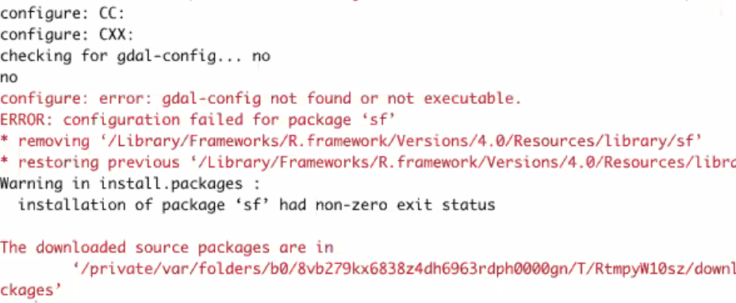
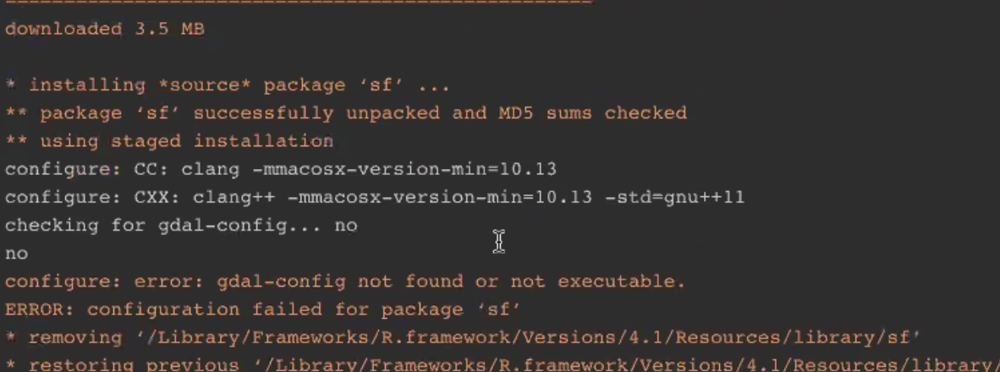
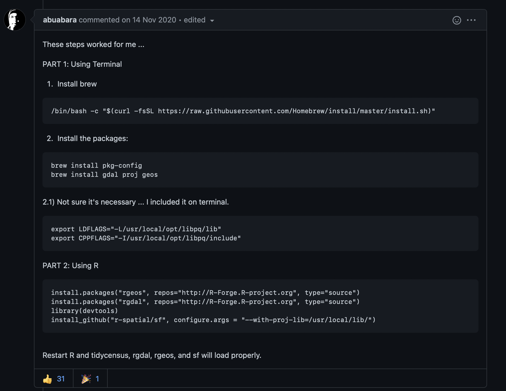
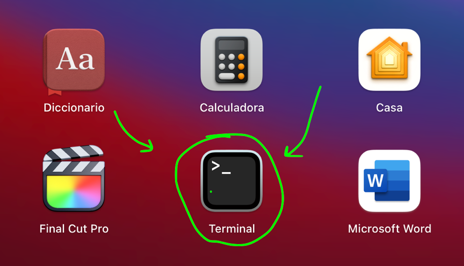
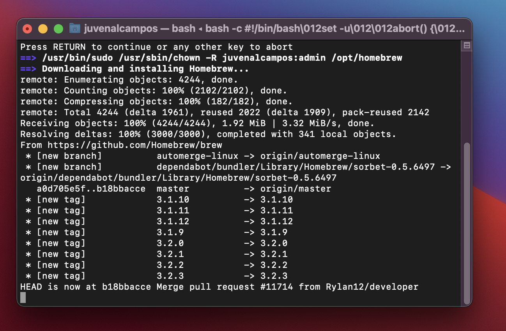
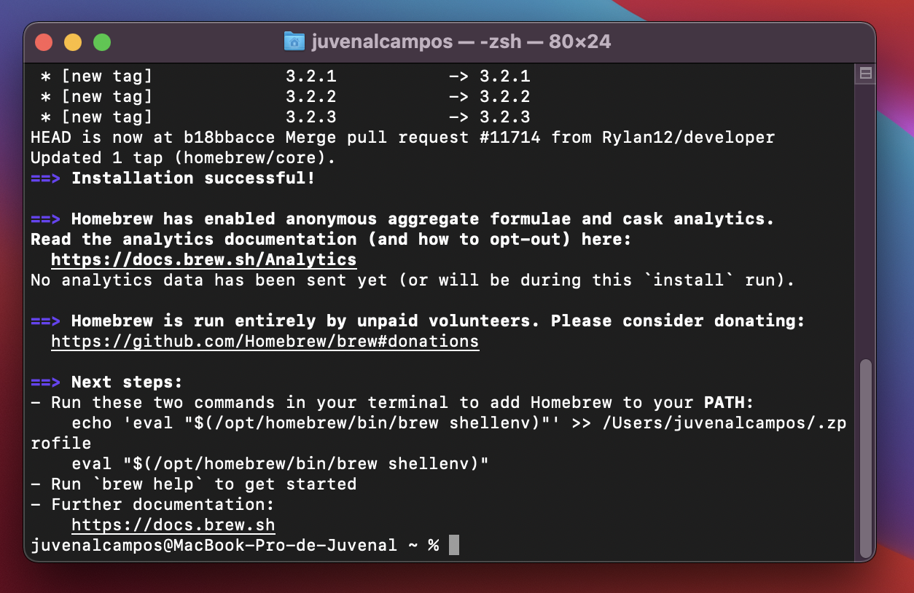
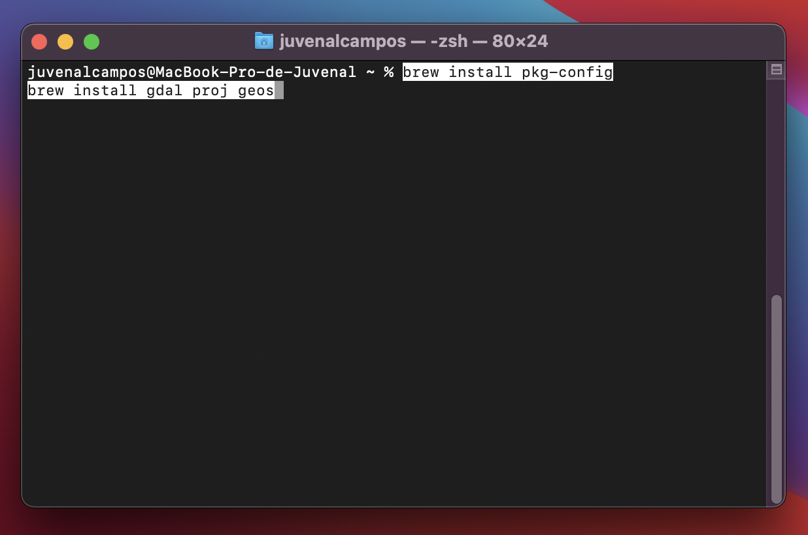
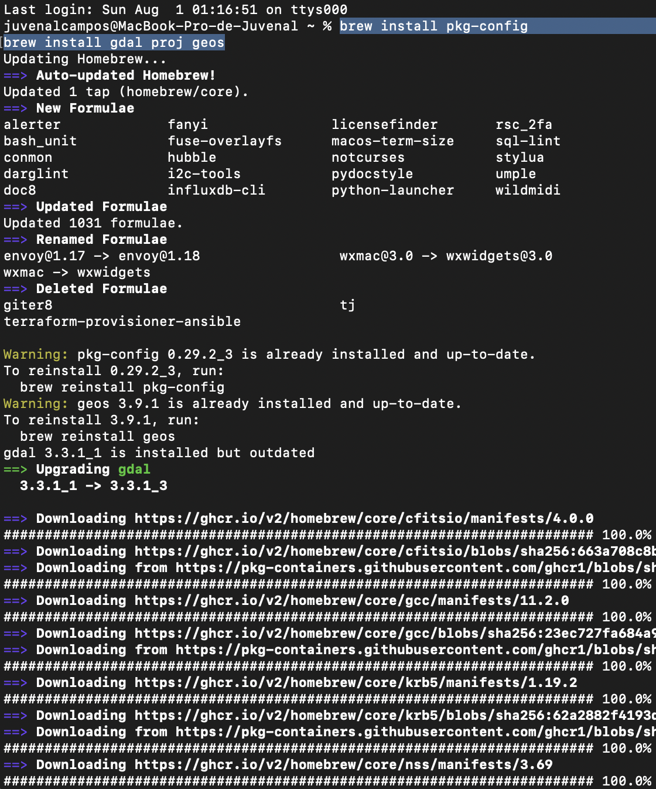
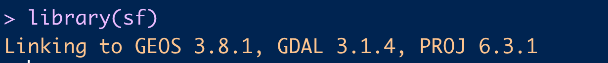

<style>

  #rcorners2 {
  border-radius: 25px;
  border: 2px solid #73AD21;
  padding: 20px; 
  width: 100%;
  height: 100%; 
}

  #rcorners_rojo {
  border-radius: 25px;
  border: 2px solid #e34d40;
  padding: 20px; 
  width: 100%;
  height: 100%; 
}

  p.centrado {
    text-align: center;
  }

  p.footnote{
  color:#5e5e5e;
  font-size:90%;
  text-align:center;
  }
  
  img {
    width: 90%;
    height: auto;
    text-align:center; 
}

  i {
  color:#5e5e5e;
  }
  
  strong {
    font-weight: 1000;
    color:white;
    font-face:bold;
    background-color: #3366FF;
  }  
    
</style>

Resolviendo el problema de la instalación del paquete sf en mac. 

# TL;DR

<p id = "rcorners2">En esta entrada de blog se discute una solución para el problema de la instalación del paquete sf de R ocasionado por la falta del paquete `gdal` en las computadoras que corren MacOS.</p>

<p id = "rcorners_rojo">Si quieres solamente el procedimiento (sin la explicación extra) solo lee los párrafos encerrados en <b style = 'color:red;'>rojo</b>.</p>

# Introducción

Mi librería/paquete favorito para realizar mapas en R es la librería `sf`. Esta librería es una de las más modernas a la hora de leer y procesar datos que provienen de archivos que guardan información geográfica (como shapefiles, geojsons o kmls). Esta librería me facilita bastante el trabajo de preparar los datos a la hora de hacer mapas, y por lo tanto, esta entre las 5 librerías que más utilizo cuando trabajo en R. 

Últimamente he notado que algunos usuarios de Mac, principalmente aquellos que acaban de comprar una nueva computadora o los que estan empezando a aprender R, han tenido problemas de instalación de esta librería, arrojando un error similar al siguiente: 

 



<p class = 'footnote'>Fig. 1. Error de instalación de `sf` en Mac.</p>

De la redacción del error (y de una googleada rápida), de `configure: error: gdal-config not found or not executable`, podemos determinar que lo que ocurre es que nos falta el paquete de software `gdal` instalado en nuestra computadora. 

# Tips para lidiar con problemas de instalación de paquetes en R. 

1.	**Verifica que escribiste el nombre correcto del paquete de R.** Esto es el principal problema al cual se enfrenta una persona que apenas está empezando y no se sabe bien los nombres de los paquetes. 


<p class = 'footnote'>Fig. 2. Así se ve cuando escribes mal el nombre de la librería a instalar.</p>

El problema con la redacción del error es que nos hace pensar que el problema es la versión de R, sin embargo, el problema es que estamos instalando un paquete que no existe (porque el nombre esta mal escrito).

2.	**El paquete no está en el CRAN.** 

Otro error muy comun pasa cuando, de repente, buscamos tutoriales para hacer cosas muy específicas en R y nos salen librerías que, al tratar de instalarlas, no se encuentran disponibles en la lista de las librerías que podemos descargar desde RStudio; es decir, no estan en el CRAN y el asistente (o la función `install.packages()`) no la puede encontrar y descargar. 

El CRAN (Comprehensive R Archive Network) es un conjunto se sitios en donde se almacenan (entre otras cosas) los paquetes de R que cumplen ciertos requisitos de calidad de publicación; entre ellos se encuentran el no ser triviales, el ser actualizados frecuentemente, el no incluir virus o ni código ejecutable por si mismo e incluir documentación completa.

Un paquete no esta en el CRAN porque no cumple los requisitos anteriores, porque esta en evaluación para entrar a estos repositorios, porque se utilizan dependencias externas (el paquete requiere de programas externos que no tienen que ver con R) o simplemente porque el autor no lo quiere enviar al CRAN. 

En estos casos, lo más recomendable es googlear el paquete que queremos descargar, ver si tiene repositorio en GitHub y seguir las instrucciones de descarga. Generalmente estas descargas de paquetes fuera del CRAN se realizan con las librerías `remotes` o `devtools`, pero para mayor seguridad siempre hay que revisar las instrucciones proporcionadas por el autor de la librería correspondiente.

3.	**El paquete usa dependencias externas.**

En este caso, lo que hay que hacer es, igualmente, seguir las instrucciones de instalación e instalar todos los programas que el paquete requiere para funcionar. Un ejemplo muy claro son los paquetes de la familia de RJava, los cuales no funcionan si no tienes Java instalado. 

### Otros conceptos básicos: 

Para entender la solución al problema de la instalación de sf en el mac, no estaría mal que conocieras varios de los conceptos que vienen a continuación: 

-	**Paquete de software:** Es un grupo de uno o más archivos que son necesarios tanto para la ejecución de un programa de computadora como para agregar características a un programa ya instalado. 

Es un tipo de archivo que contiene programas de computadora y metadatos adicionales requeridos por los administradores de paquetes para su ejecución. Pueden contener tanto código fuente como archivos ejecutables. 

El programa puede estar en su código fuente y puede requerir primero ser compilado y construido primero. 
https://en.wikipedia.org/wiki/Package_format

-	**Brew o Homebrew**: Es un gestor de paquetes para MacOS. Nos permite instalar “todo aquello que necesites” que Apple no instala de serie. Complementa macOS. Permite instalar aplicaciones, fuentes, plugins y otros tipos de software. 


<p class = 'footnote'>Fig. 3. Instalación de Homebrew.</p>

-	**`gdal`**: Es una biblioteca de software para la lectura y escritura de formatos de datos geoespaciales. Esta librería es lanzada por la Open Source Geospatial Foundation bajo una licencia Open Source X/MIT. Contiene, entre otras cosas, una variedad de utilidades en línea de comando para la traducción y el procesamiento de datos geoespaciales. 

Usan GDAL: 

-	QGIS
-	GRASS GIS
-	MapServer
-	Google Earth
-	Kosmo
-	Mapguide Open Source. 

De los cuales, la verdad, solo conozco QGis. Sospecho que quienes instalan previamente Qgis en sus Mac no tienen este problema, pero no estoy del todo seguro. 

# Donde encontré la solución: 

<p id = "rcorners_rojo">La propuesta de solución al error de instalación la proporcionó el usuario abuabara en Github el 14 de noviembre del 2020. Para acceder a la publicación original puedes llegar a ella desde este enlace: https://github.com/r-spatial/sf/issues/1536 </p>



<p class = 'footnote'>Fig. 4. Propuesta de solución de Github que me funcionó.</p>

## Procedimiento en mi computadora. 

1. **Abrimos la terminal.**



<p class = 'footnote'>Fig. 5. La terminal en mi computadora.</p>

<p id = "rcorners_rojo">La terminal de la computadora es ese programa que tiene apariencia de ser usado solo por hackers y sirve para acceder a las tripas del sistema de tu computadora. Si bien los usuarios de R rara vez nos tenemos que meter a usar este programa, no esta de mas irle perdiendo un poquito el miedo.</p>

2. **Instalamos brew introduciendo en la terminal el código indicado arriba, que es este (solo copiar y pegar):**

```
/bin/bash -c "$(curl -fsSL https://raw.githubusercontent.com/Homebrew/install/master/install.sh)"
```

<p id = "rcorners_rojo">Instalamos Homebrew para poder instalar paquetes de sistema externos a nuestra computadora. Si no te convence esto, hay muchos videos para instalar Homebrew en Youtube (en caso de que tengas problemas en la descarga e instalación). </p>





<p class = 'footnote'>Fig. 6. Así se ve el proceso de instalación de Homebrew en Mac. Puede tardar un poco.</p>

## ¿Para qué mas sirve Homebrew?

Del sitio AppleCoding.com  , en este artículo (https://applecoding.com/noticias/llega-homebrew-3-soporte-nativo-apple-silicon-actualizar), podemos ver que generalmente son los desarrolladores y programadores los que utilizan Homebrew para la gestión de paquetes. Entre estos se encuentran la instalación de Python, Ruby, Node.js, Clojure, Jenkins, PostgreSQL, htop, imagemagick, entre otros. 

Otro post interesante para aprender la utilidad de Homebrew es el escrito por Matthew Brodberg, el cual nos explica como lo utiliza para la automatización de procesos y tener actualizados sus programas en Mac: https://opensource.com/article/20/6/homebrew-mac

3. **Una vez que ya tenemos instalado Homebrew, corremos los comandos brew que vienen en las instrucciones:**

```
brew install pkg-config
brew install gdal proj geos
```



<p class = 'footnote'>Fig. 7. Instalación de los paquetes de software en la computadora.</p>

<p id = "rcorners_rojo">Esto iniciará un proceso en la computadora para instalar el paquete `proj`, `gdal` y `geos` (necesarios para `sf`). Este proceso se ve como se muestra a continuación: </p>



<p class = 'footnote'>Fig. 8. Así se ve el proceso en la computadora.</p>

4. **Guardamos en la computadora las variables de sistema:**

<p id = "rcorners_rojo">Escribimos en la terminal lo siguiente: </p>

```
export LDFLAGS="-L/usr/local/opt/libpq/lib"
export CPPFLAGS="-I/usr/local/opt/libpq/include"
```

5. **Finalmente, instalamos en R las librerías que vamos a necesitar y al final, instalamos `sf`.**

```
# Para instalar rgeos
install.packages ("rgeos", repos="http://R-Forge.R-project.org", type="source")
# Para instalar rgdal
install.packages ("rgdal", repos="http://R-Forge.R-project.org", type="source")
# Llamamos devtools para instalar la version de Github de sf
library (devtools)
# Instalamos sf desde su version de <github 
install_github("r-spatial/sf", configure.args = "--with-proj-lib=/usr/local/lib/")
```

<p id = "rcorners_rojo">Una vez que instalamos todas las librerías de R necesarias, ya podremos llamar a la librería `sf`. Llamar a esta librería (sin problemas) deberia verse como a continuación: </p>



<p class = 'footnote'>Fig. 9. Así se ve cuando cargamos bien el paquete `sf`.</p>

Y ahora si, ya podremos construir mapas y procesar información geográfica desde nuestra Mac. 

# Motivación para escribir esta guía: 

En Diciembre del 2020 me compré un Mac Mini M1 y al configurar mis paquetes de R en la nueva computadora, me brotó este error; solucionandolo al igual que en este artículo y pensando que sería más un tema del procesador nuevo que del sistema operativo (acababa de salir el M1 y estaba dando problemas en todos lados). Meses despues, un colega me preguntó como resolver el mismo problema y, tras mandarle la solución, se nos olvidó a ambos documentarlo. Finalmente, a unas amigas a las que ando asesorando en temas de R les dio el mismo error y en ese momeno me di cuenta que necesitaba documentar esta solucion para estar cubierto la próxima vez que me tocara enseñar la parte de las librerías de R necesarias para elaborar mapas. 

Aparte, me sorprendió sacarle tanto jugo a un error y todas las cosas que aprendí en el proceso de escribir esta entrada de blog. :3 . Si bien estas cosas no suelen ser un problema para las personas que llevan usando R desde hace un buen rato, para las personas que apenas van empezando este tipo de situaciones pueden ser bastante frustrantes e incómodas. 

Es por esto que me animé a escribir sobre este error, con la esperanza de que mas personas (sean mis alumnos o no) usuarias de Mac no se detengan en hacer sus mapitas en R y no tengan problemas en descargar esta u otras librerías más adelante. :3

