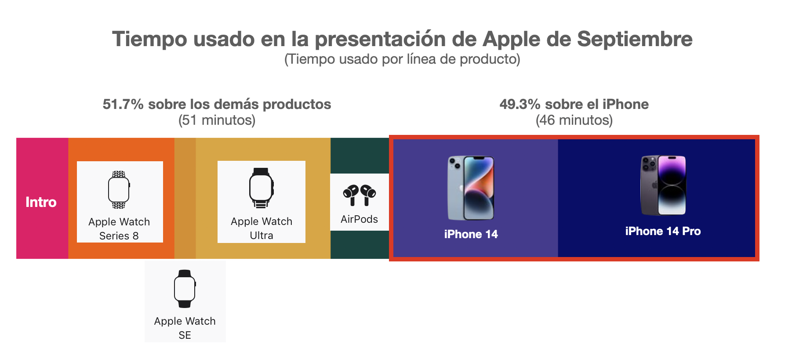

## Características, precios y demanda: analicemos los datos el lanzamiento del teléfono más esperado del 2022.

Los lanzamientos de productos tecnológicos suelen ser año con año eventos altamente esperados por los fanáticos de sus respectivas marcas, y ningún producto tecnológico es más anticipado año con año que el nuevo modelo del iPhone de Apple. La presentación del producto insignia de la empresa californiana suele ser un evento visto por millones de personas a lo largo del planeta, y no es para menos, ya que, si bien Apple no es la marca de celulares más vendida del mundo, el iPhone si es de los modelos de teléfono más solicitados por las masas, a tal grado de [ocupar el 16% de la cuota de mercado de smartphones mundial](https://www.counterpointresearch.com/global-smartphone-share/). 

Los modelos presentados este año fueron el iPhone 14 y el iPhone 14 Pro en dos tamaños (6.1 y 6.7 pulgadas para cada modelo). El modelo base, el iPhone 14, cuenta con el mismo diseño, el mismo procesador y el mismo número de cámaras que la versión anterior, con la única diferencia de presentar un modelo cuya diagonal es 0.6 pulgadas más grande. 

iPhone 14 Pro (izq) y iPhone 14 (der)

El modelo Pro cuenta igualmente con ligeras mejoras en el hardware, siendo su principal diferencia con respecto al modelo del año pasado la sustitución del notch o pestaña de la cámara frontal, colocando lo que la empresa denomina como “isla dinámica”. Esta isla es una abertura de mas pequeña en la parte superior de la pantalla que, en conjunto con el sistema operativo, adquiere distintas formas de acuerdo a la información que el teléfono desea proporcionar al usuario, haciendolo pensar que la abertura es un elemento más de la pantalla y de la interfaz de usuario.

Otras características nuevas de los teléfonos fueron funcionalidades que nadie de sus usuarios desearía estar en situación de necesitar: la detección de choques vehiculares (Crash Detection) y el envío de mensajes de emergencia a través de satélites. La primera funcionalidad consiste en añadir sensores para detectar si el usuario se ha visto envuelto en un accidente y llamar a los servicios de emergencia en caso de que el usuario no pueda realizar esa comunicación, mientras que la segunda consiste en permitir a los usuarios en una situación emergencia lejos de la señal de teléfono el poder solicitar un rescate.

Lo que no tiene de nuevo (y muchos usuarios demandaban) era la adopción del estándar USB-C en los nuevos modelos. Actualmente el teléfono sigue usando su propia entrada de carga (el estándar Lightning), introducido desde 2011 y  el cual es el principal motivo de que todavía tengamos el “cargador de iPhone” y el “cargador de Android”. Este cambio, por lo visto, no llegará hasta dentro de unos años, dado que las leyes europeas le exigirán a la compañía la incorporación de este puerto de carga para los teléfonos que se vendan en Europa a partir del 2024. 

Fuera de estas características, los teléfonos no presentan mayores innovaciones, y eso ha sido una queja entre los fanáticos de la marca y un factor que ha hecho a varios usuarios el reconsiderar su decisión de compra para el presente año.

# PRESENTACIÓN: 

La presentación del iPhone fue el 7 de septiembre. En ella se presentaron, junto a los teléfonos, tres nuevos modelos del Apple Watch: el Series 7, el SE y el Apple Watch Max. A la fecha, el video ha sido visto por más de [28 Millones de reproducciones](https://www.youtube.com/watch?v=ux6zXguiqxM) de espectadores en el canal oficial de Apple en Youtube. Como referencia, el video de [presentación del Samsung Galaxy S22](https://www.youtube.com/watch?v=KpTBm_fg-Wk), a la misma fecha, tiene 17 millones de visitas (a pesar de haber salido 8 meses antes). El evento fue tan visualizado que incluso surgieron noticias como estas.

Para acentuar la importancia del teléfono, podemos ver que la presentación de estos duró el 49% del tiempo total de la presentación total, como puede verse en la siguiente gráfica: 

Duración de cada segmento en la presentación de Apple de Septiembre

# ¿Cuanto cuesta un iPhone en México? 

En nuestro país la página oficial de Apple vende, al día de hoy, 8 modelos distintos de iPhone, cuyos precios van desde los $11,499 pesos para el iPhone SE de 64 GB al más caro, el nuevo iPhone 14 Pro Max de 1 TB, el cual cuesta $41,999 pesos mexicanos. A diferencia de otros mercados (como el europeo) y a pesar de las tasas de inflación en el mundo, el precio del teléfono se mantuvo igual al precio con el que salió el iPhone 13 el año pasado. 

Precios del iPhone en México en Septiembre del 2022

Como dato adicional, con el [salario promedio mensual de México ($5,230 MXN)](https://datamexico.org/es/profile/geo/mexico?occupationMetrics=salaryOption&patentsEvolution=approvedPatents&totalAndInformalJob=totalOption) se requerirían poco más de cuatro meses, sin gastar en nada adicional, para que un mexicano con este salario pueda comprar el modelo más reciente en su versión de menor capacidad de memoria. 

# Recepción del teléfono:

La falta de innovación es algo que le ha pasado factura a lo largo de las fechas de preventa al nuevo teléfono: según [reportes del analista Ming Chi Kuo](https://twitter.com/mingchikuo/status/1571883138653257728), las pre-ventas de los iPhone 14 han sido tan bajas que parece que algunos proveedores de la cadena de suministro estarán redirigiendo la producción a los modelos Pro, los cuales han sido más demandados durante esta etapa inicial. En mi opinión, esto parece ser un castigo de los usuarios ante un teléfono poco innovativo y que recicla componentes de la generación anterior, además de no ofrecer un rediseño radical como para justificar el gasto en un nuevo celular, además de que lo incierto de la situación económica para los próximos meses puede retrasar algunas decisiones de compra entre el público objetivo de los modelos básicos de este teléfono. 

Pero si bien nos quejamos mucho de la falta de innovación en este mercado (principalmente de las grandes compañías), habría que preguntarnos acerca de qué innovaciones hacen falta en nuestra vida moderna como para que un teléfono moderno nos vuelva a sorprender. Los teléfonos modernos tienen cámaras que están muy cerca de competir con los equipos fotográficos profesionales, las pantallas tienen resoluciones que hacen imposible ver los pixeles con el ojo humano y los teléfonos cuentan con una gran cantidad de sensores y procesos de inteligencia artificial que es cada vez más complicado innovar en estos aspectos. Y aunque la innovación en la producción de teléfonos sea cada vez más complicada, acá estaremos, año con año, viendo la presentación de apple esperando que nos vuelvan a sorprender otra vez. 

